# GitLab Monitor - K9s for GitLab

A K9s-style Terminal User Interface for GitLab. Real-time pipeline monitoring, cross-project merge request triage, a per-project dashboard, commit and tag browsing, and quick actions (merge an MR, create a tag, roll a deploy back to a previous tag) — all without leaving the terminal.

<p align="center">
  <a href="glmon-assets/Pipeline-list.png">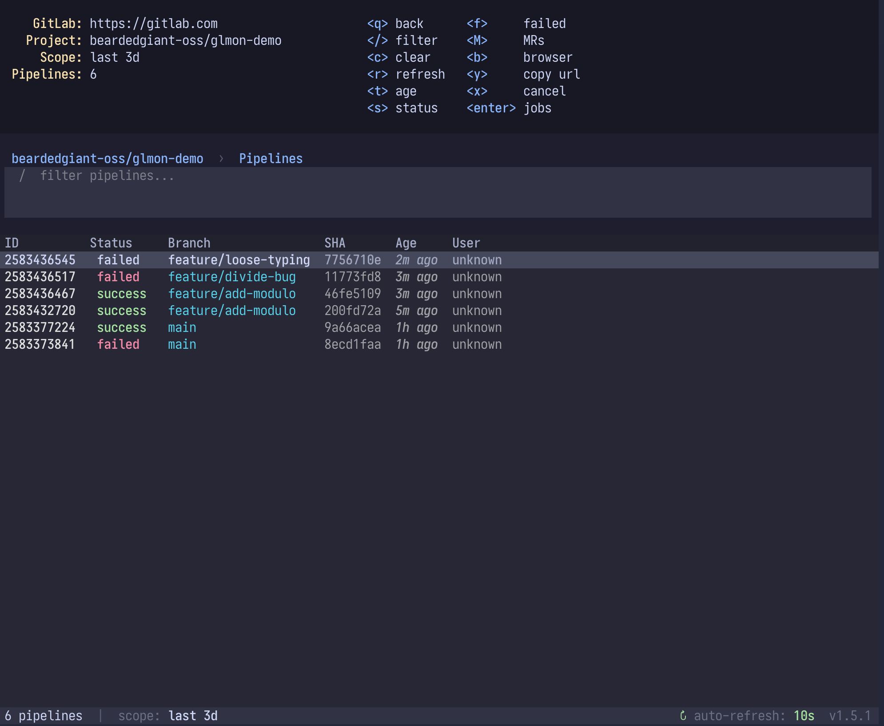</a>
</p>

## Installation

### Homebrew (recommended)

```bash
brew tap bearded-giant/tap
brew install gitlab-monitor
```

### From source (development)

```bash
cd gitlab-monitor
make install        # release version from pyproject.toml
make install-dev    # bakes a dev build, version becomes 1.5.15.dev0+<7sha>[.dirty]
make dev            # editable install (-e), source changes auto-apply
make version        # print the dev version that install-dev would use
```

`make install-dev` rewrites the version in `pyproject.toml` temporarily so the installed package carries a sha-tagged dev version. `glmon --version` confirms which build is running. The LoadingScreen splash also shows the version.

### Debug logging (dev builds)

Dev builds (any version containing `.dev`) automatically write to `/tmp/glmon-debug.log`. Useful for verifying which screen mounted, when loading indicators fire, and any silent exceptions in the status-bar update path.

```bash
make install-dev
glmon            # use normally
tail -f /tmp/glmon-debug.log
```

- Override path: `GLMON_DEBUG_LOG=/some/other/path glmon`
- Disable on a dev build: `GLMON_DEBUG_LOG=off glmon`
- Release builds (e.g. `1.5.15`) never log regardless of env

## Configuration

### Required Environment Variables
```bash
export GITLAB_URL=https://gitlab.example.com
export GITLAB_TOKEN=your_personal_access_token
```

### Optional Environment Variables
```bash
export GITLAB_PROJECT=group/project         # skip project picker, go straight to pipelines
export GITLAB_REFRESH_INTERVAL=30           # seconds between auto-refresh (default: 30)
```

#### Refresh Tuning (per-view, optional)
Override default refresh cadences for each view. Useful when GitLab traces are large and the log view auto-refresh appears stalled — bump `GLMON_FETCH_TIMEOUT` and/or `GLMON_TRACE_REFRESH_INTERVAL` so the trace GET completes before the next tick.

```bash
export GLMON_PIPELINE_REFRESH_INTERVAL=10   # pipeline list refresh (default: 10s)
export GLMON_JOB_REFRESH_INTERVAL=10        # job list refresh (default: 10s)
export GLMON_LOG_REFRESH_INTERVAL=5         # log view: status/duration meta tick (default: 5s)
export GLMON_TRACE_REFRESH_INTERVAL=20      # log view: trace fetch cadence (default: 20s)
export GLMON_FETCH_TIMEOUT=30               # per-fetch timeout in log view (default: 30s)
```

The log view splits refresh into a fast meta tick (job status + duration via small JSON GET) and a slower trace tick (full job log download). This keeps duration current at low cost while avoiding overlapping multi-MB trace fetches that would lock the auto-refresh.

### Config File (Optional)
Configuration can also be stored in `~/.config/gitlab-monitor/config.json`:
```json
{
  "gitlab_url": "https://gitlab.example.com",
  "project_path": "group/project",
  "refresh_interval": 30,
  "max_pipelines": 50
}
```

Note: Never store tokens in config files. Always use environment variables for tokens.

## Quick Start

After installation, the tool is available as `gitlab-monitor` or `glmon` (short alias):

```bash
glmon                                # lands on My Work (cross-project home)
glmon -p group/subgroup/project      # skip the home, jump straight into a project
glmon --days 7                       # default pipeline window: 7 days (default: 3)
glmon -p group/project --days 30     # combined
glmon -p group/project -B            # pre-filter pipelines to the CWD git branch
```

By default `glmon` opens **My Work** — your starred repos plus your open MRs grouped by source branch, pulled across every project. Press `m` (or `tab`) anywhere to open the module switcher and jump to the Project Hub, MRs, Pipelines, or Tags. Set `GITLAB_PROJECT` or pass `-p` to skip the home entirely and drop straight into a project's pipeline list.

### CLI Arguments

| Flag | Description |
|------|-------------|
| `-p, --project PATH` | Jump directly into `group/project` (skips the home). Overrides `GITLAB_PROJECT`. |
| `--days N` | Default pipeline age window in days. Default: 3. Cycle in-app with `t`. |
| `-b, --branch NAME` | Pre-fill the pipeline filter with this branch (clearable in the UI). |
| `-B, --cwd-branch` | Pre-fill the pipeline filter with the current git branch detected from the working directory. |

## Features

1. **My Work home** -- cross-project landing screen: your starred repos plus your open MRs grouped by source branch, gathered from every project at once
2. **Module switcher** -- `m`/`tab` from any home screen to jump between My Work, Project Hub, MRs, Pipelines, and Tags; number keys `1`-`5` jump directly
3. **Project Hub** -- per-project dashboard with live commits, MRs, tags, and pipeline panels side by side; `[`/`]` to cycle, capital letters to open a full view
4. **Project picker with favorites** -- star projects you care about; favorites load first (fast), toggle to full list on demand
5. **Pipeline age window** -- default 3 days (big speedup on busy projects); cycle `3d / 7d / 30d / all` with `t`
6. **Real-time auto-refresh** -- pipeline and job lists refresh every 10 seconds, job detail every 5 seconds
7. **Multi-level drill-down** -- Projects -> Pipelines -> Jobs -> Logs, with per-step breakdown
8. **Merge request triage** -- cross-project and per-project MR lists, full detail view, approval state, per-MR local notes, markdown export
9. **MR quick actions** -- merge, toggle auto-merge (merge-when-pipeline-succeeds), approve, close, and comment straight from the detail view
10. **Tag management** -- list tags with per-tag pipeline status; create + push a tag (`t`), roll a deploy back by re-running an older tag's pipeline (`R`), or open a revert MR for a tag's commit (`V`)
11. **Commit browser** -- browse commits per project/branch, drill into commit detail and its pipeline
12. **Filtering** -- K9s-style filter bar for branch/user, plus quick status toggles (failed / success / running)
13. **Failure extraction** -- automatically extracts and highlights test failures; failed jobs flagged in red
14. **Browser + clipboard** -- `b` opens the current selection in GitLab, `y` copies its URL or log output
15. **Job detail info bar** -- live status and duration while viewing job logs

## Views

### 1. My Work (home)

The default landing screen. Two panels: your **Favorites** (starred repos) and **My Open MRs** — every MR you authored, across all projects, grouped by source branch. Cycle panels with `[`/`]`, `enter` to open the highlighted repo (into its Project Hub) or MR (into detail). `M` jumps to the full MRs list, `P` to your pipelines. This is module `1`; it always opens here (no last-view restore). `esc` or `Ctrl+c` quits the app; `q` is back-only and a no-op on the home.

### 2. Module Switcher

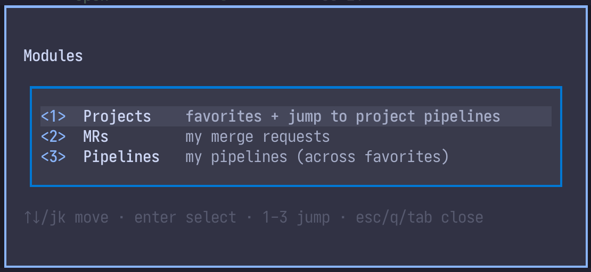

Press `m` or `tab` from any home screen to switch modules. Five of them:

| # | Module | What |
|---|--------|------|
| 1 | My Work | favorites + my open MRs by branch |
| 2 | Project Hub | a project's commits, MRs, tags, pipelines |
| 3 | MRs | my merge requests |
| 4 | Pipelines | my pipelines across favorites |
| 5 | Tags | a project's tags + create/push/rollback |

Navigate with `↑↓` or `j/k`, `enter` to confirm. Number keys `1`-`5` jump directly. `esc`/`q`/`tab` closes.

### 3. Project Picker (when no project set)

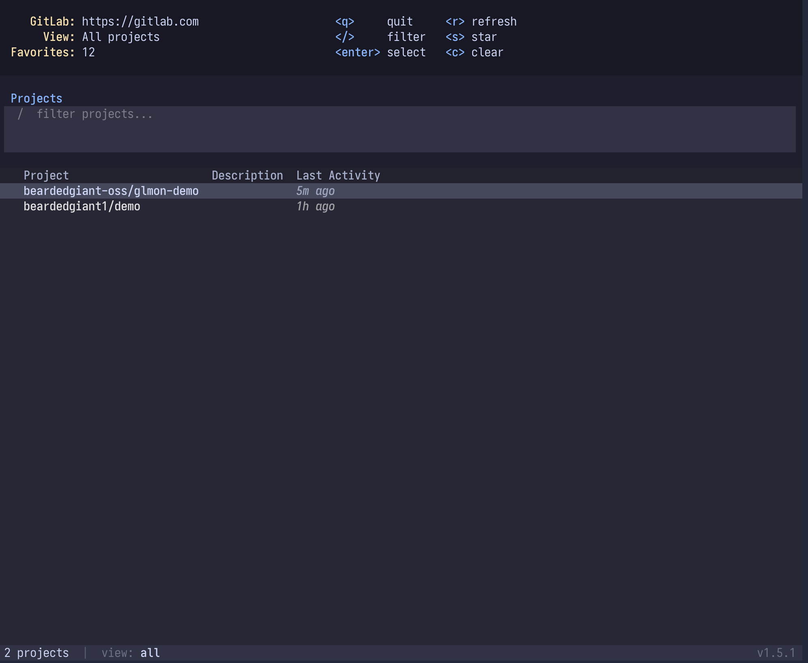

Defaults to **Favorites** view if any projects are starred (fast, no full project listing). Press `a` to toggle to **All** projects (sorted by last activity, favorites pinned to top). A leading `*` column marks starred projects. Type to filter, Enter to select, `s` to star/unstar.

Favorites persist to `~/.config/gitlab-monitor/favorites.json`.

### 4. Project Hub

The per-project dashboard (module `2`). One screen with four live panels — recent **Commits**, open **MRs**, latest **Tags**, and recent **Pipelines** — laid out side by side when the terminal is wide, stacked when narrow. The header carries the project's commit/MR/tag/pipeline counts.

Cycle the focused panel with `[` and `]`, `enter` opens the highlighted row, and `t` cycles the commit window (`1d / 3d / 7d`). Capital letters open a panel as its own full view: `C` commits, `M` MRs, `P` pipelines, `T` tags.

### 5. Pipeline List View


Shows recent pipelines with ID, status (color-coded), branch, creation time, and commit SHA. Defaults to the last 3 days to keep load fast on busy projects. Press `t` to cycle window: `3d -> 7d -> 30d -> all`. Current window shown in breadcrumb. `M` jumps to this project's MRs, `P` to your pipelines.

K9s-style filter bar — press `/` to filter by branch or user:

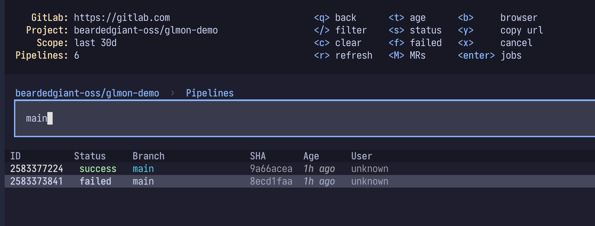

Quick status toggles narrow the list to a single status (failed / success / running) without typing a filter:

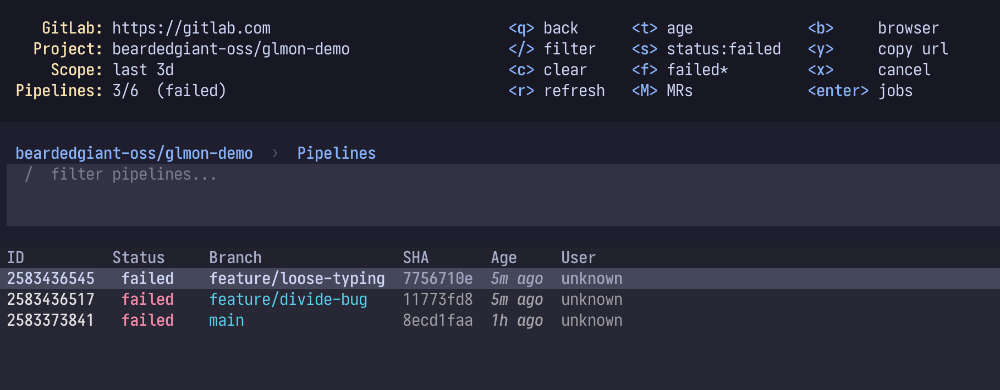

### 6. Job List View

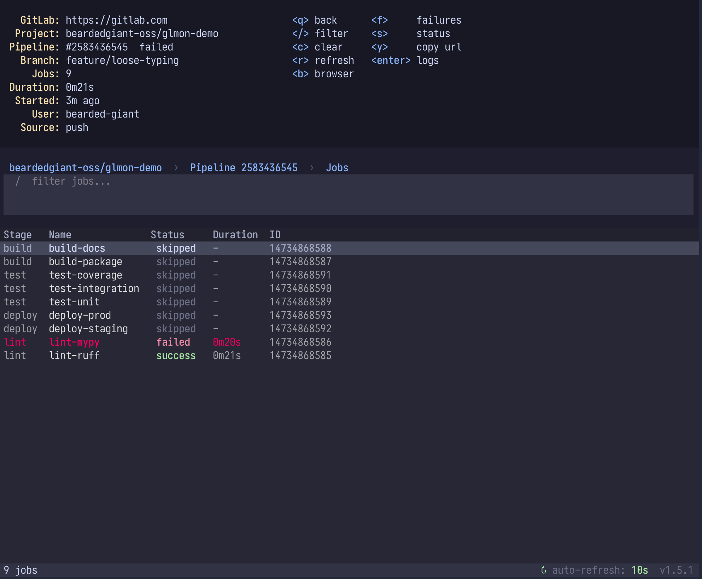

Shows all jobs in a pipeline grouped by stage (build, test, deploy, cleanup) with color-coded status and duration.

### 7. Job Detail View

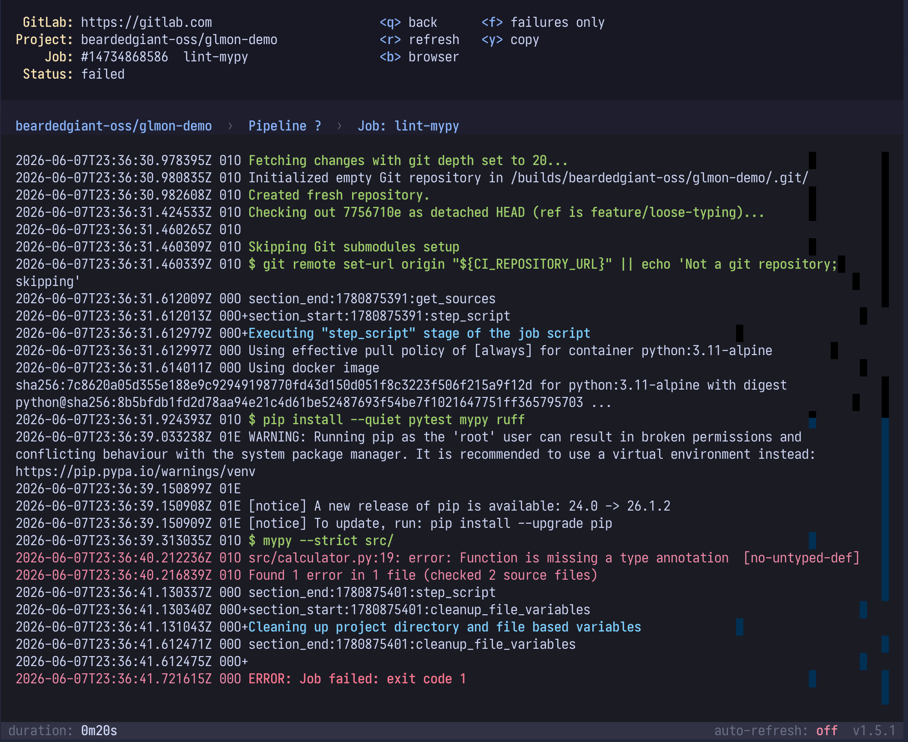

Shows job logs with a live status/duration info bar, failure summary at top (for failed jobs), full trace, and error line highlighting. Log output streams incrementally as the job runs.

Drill further into per-step breakdown (pipeline → job → steps):

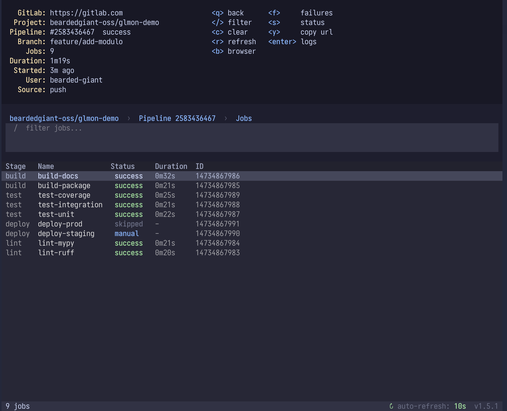

### 8. Failed Jobs Summary View
Quick view of all failed jobs in a pipeline with extracted failure messages.

### 9. Merge Requests

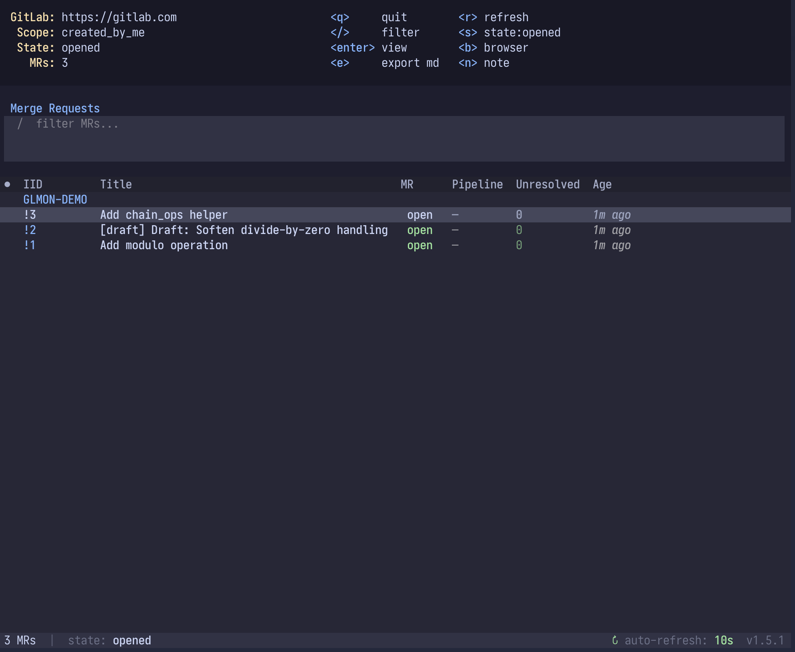

Two flavors: **My MRs** (module `3`) is a cross-project view of the MRs you authored, grouped by repository; **Project MRs** (reached with `M` from a project's pipeline list) scopes to one project. Both support `/` filter, `s` to cycle state (opened / merged / closed / all), and `b`/`y` for browser/copy. Per-MR local notes show a yellow `●` glyph; `e` exports the list to markdown. From My MRs you can also toggle auto-merge (`A`) or merge (`M`) without opening the MR.

### 10. Merge Request Detail

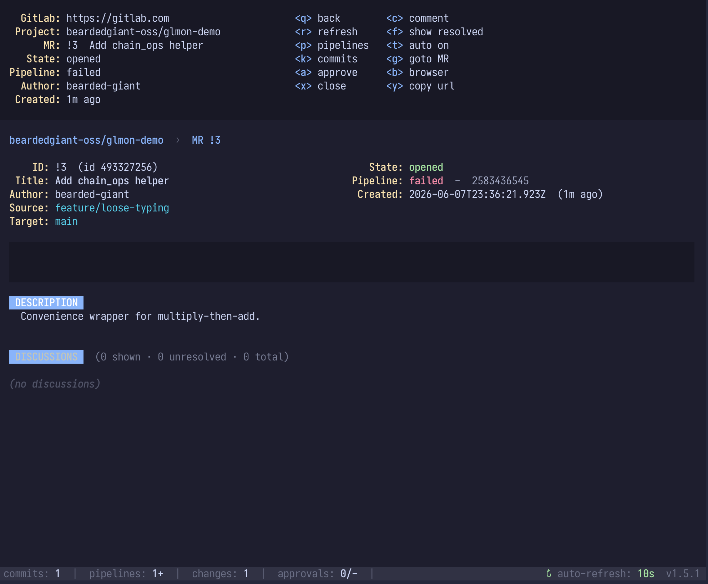

Title, description, author, source/target branches, pipeline status, and approval state. Drill into pipelines (`p`) or commits (`k`) from here. Quick actions, each behind a confirm: merge (`M`), toggle auto-merge / merge-when-pipeline-succeeds (`A`), approve (`a`), close (`x`), and comment (`c`). `f` toggles resolved discussions.

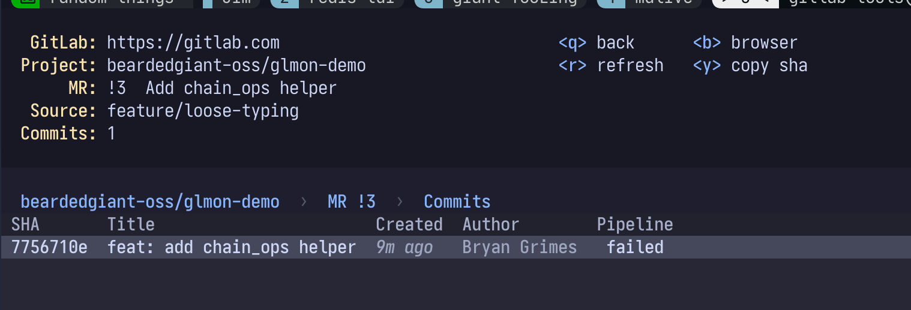

### 11. MR Notes

Local-only notes per MR (`~/.config/gitlab-monitor/mr_notes.json`). Press `n` from the MR list:

| Create | Edit |
|--------|------|
| 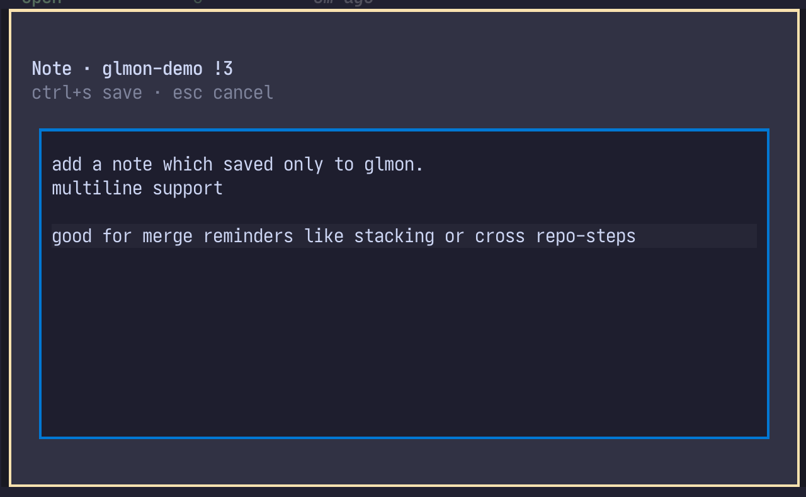 | 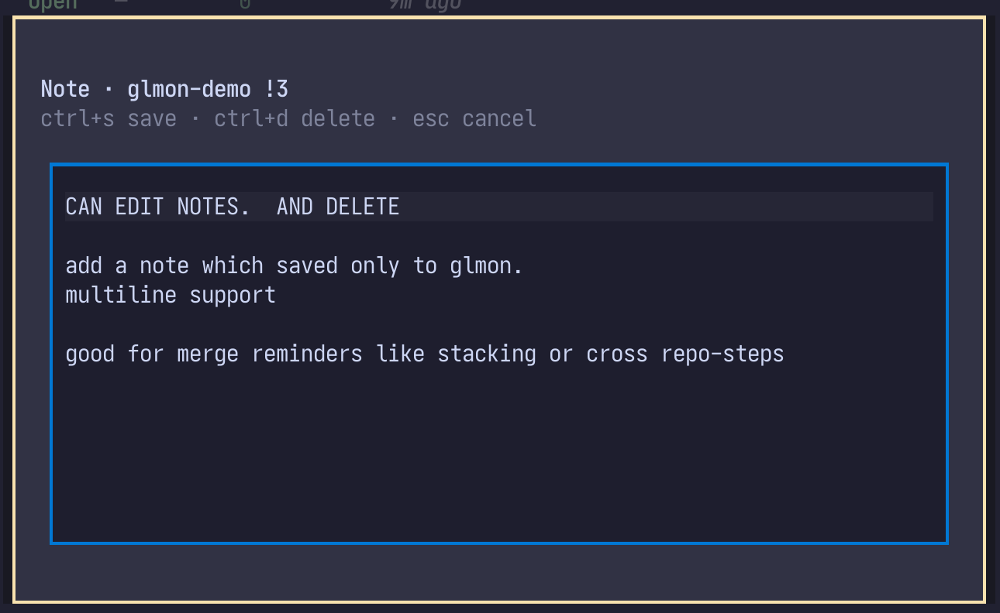 |

Notes survive across runs and inline into the markdown export as blockquotes.

### 12. Tags

The Tags view (module `5`) lists a project's tags with date, target commit, per-tag pipeline status, and message. `enter` opens the pipelines filtered to that tag. Three actions:

| Key | Action |
|-----|--------|
| `t` | Create + push a new tag (suggests the next minor version) on the default branch |
| `R` | Run the selected tag's pipeline — re-run a tag, or roll a deploy back by running an older tag (deploys on tag run automatically) |
| `V` | Open a merge request that reverts the selected tag's commit on the default branch |

Rolling back a deploy is two steps: put the cursor on the last known-good tag and press `R` to redeploy it, then put the cursor on the bad tag and press `V` to open the revert MR that realigns source. Both prompt before hitting the API. The revert MR is created entirely through the GitLab API (a `revert-<tag>` branch off the default branch, the revert commit pushed to it, and the MR opened) — no local checkout needed; it opens in your browser on success.

### 13. Commit Browser

Browse commits for a project (or a branch), reached from the Project Hub's Commits panel or `k` on an MR. Columns show author, message, and pipeline status; `t` cycles the time window. `enter` opens commit detail — changed files and stats — and `p` jumps to that commit's pipeline.

### 14. Confirmations

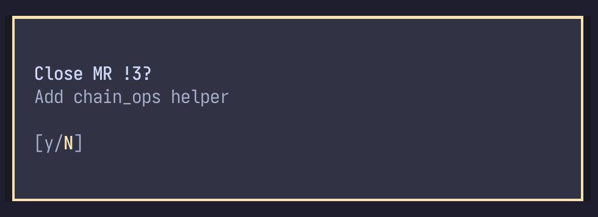

Every write action — merge, close, create tag, rollback, revert — surfaces a `y/N` modal (defaulting to No) before hitting the API.

## Keyboard Shortcuts

Keys are case-sensitive (`R` is not `r`) and each screen only handles the keys listed for it.

### Global

| Key | Action |
|-----|--------|
| `q` | Go back one level (no-op on a home screen) |
| `Esc` / `Ctrl+c` | Quit the app |
| `r` | Refresh current view |
| `y` | Copy URL or content to clipboard |
| `b` | Open current selection in browser |
| `m` / `tab` | Open module switcher (from home screens) |
| `Up/Down` / `j/k` | Navigate |
| `Enter` | Select / drill down |

### My Work (home)

| Key | Action |
|-----|--------|
| `[` / `]` | Cycle panel (Favorites / My Open MRs) |
| `Enter` | Open highlighted repo (hub) or MR (detail) |
| `M` | Full MRs list |
| `P` | My pipelines |

### Project Hub

| Key | Action |
|-----|--------|
| `[` / `]` | Cycle panel (Commits / MRs / Pipelines / Tags) |
| `t` | Cycle commit window: 1d -> 3d -> 7d |
| `C` / `M` / `P` / `T` | Open Commits / MRs / Pipelines / Tags as a full view |
| `Enter` | Open highlighted row |

### Project Picker

| Key | Action |
|-----|--------|
| `/` | Focus search input |
| `s` | Star / unstar current project |
| `a` | Toggle view: Favorites only <-> All projects |
| `Down` / `Escape` | Move from search to project list |

### Pipeline List View

| Key | Action |
|-----|--------|
| `/` | Focus filter input |
| `t` | Cycle age window: 3d -> 7d -> 30d -> all |
| `s` | Cycle status filter (failed / success / running) |
| `f` | Show failed jobs summary for selected pipeline |
| `x` | Cancel selected pipeline |
| `c` | Clear filter |
| `M` | This project's MRs |
| `P` | My pipelines |

### Job List View

| Key | Action |
|-----|--------|
| `/` | Focus filter input |
| `s` | Cycle status filter |
| `f` | Show failed jobs summary |

### Job Detail View

| Key | Action |
|-----|--------|
| `f` | Show failures only (hide full trace) |

### Merge Request List

| Key | Action |
|-----|--------|
| `/` | Focus filter input |
| `s` | Cycle state: opened / merged / closed / all |
| `g` | Go to MR by number |
| `n` | Create / edit local note (My MRs) |
| `e` | Export list to markdown (My MRs) |
| `A` | Toggle auto-merge |
| `M` | Merge |
| `p` | Pipelines for selected MR |

### Merge Request Detail

| Key | Action |
|-----|--------|
| `M` | Merge (confirm) |
| `A` | Toggle auto-merge / merge-when-pipeline-succeeds |
| `a` | Approve |
| `x` | Close |
| `c` | Comment |
| `p` / `k` | Open pipelines / commits |
| `f` | Toggle resolved discussions |

### Tags

| Key | Action |
|-----|--------|
| `/` | Focus filter input |
| `Enter` | Open pipelines filtered to selected tag |
| `t` | Create + push a new tag |
| `R` | Run selected tag's pipeline (re-run / rollback) |
| `V` | Open a revert MR for the selected tag's commit |

### Commit Browser

| Key | Action |
|-----|--------|
| `/` | Focus filter input |
| `t` | Cycle time window |
| `Enter` | Open commit detail (files + stats) |
| `p` | Open the commit's pipeline |

## Usage Examples

### Basic Workflow
1. Launch with `glmon`
2. Search or scroll to find your project, press Enter
3. Navigate pipelines with arrow keys
4. Press Enter to view jobs in a pipeline
5. Press Enter on a job to view its logs
6. Press `q` to go back up a level

### Building a Favorites List
1. Launch `glmon`, press `a` to load all projects
2. Navigate to a project you care about, press `s` to star it
3. Repeat for other projects
4. Next launch: starred projects load instantly in the default Favorites view

### Jump Straight to a Project
```bash
glmon -p my-group/my-project
```
Skips the picker entirely. Useful for shell aliases or keyboard launchers.

### Loading Older Pipelines
Default view is last 3 days. Press `t` in the pipeline list to expand to 7d, 30d, or all. Or launch with `--days 30` to set a different default.

### Investigating Failures
1. Navigate to a pipeline with failed status (red)
2. Press Enter to see jobs
3. Failed jobs are highlighted in red
4. Press `f` to see only failed jobs
5. Press Enter on a failed job to see extracted failures

### Opening in Browser
At any level, press `b` to open the current selection in your browser for full GitLab UI access.

## Status Badges

| Badge | Style |
|-------|-------|
| `success` | Green |
| `failed` | Red |
| `running` | Yellow |
| `pending` | Dim |
| `canceled` | Dim |
| `created` | Dim |
| `manual` | Blue |
| `skipped` | Dim |

## Architecture

```
PipelineMonitor (App)
    ├── LoadingScreen (splash while connecting)
    ├── MyWorkScreen (home — favorites + my open MRs)
    │   ├── ProjectHubScreen (commits / MRs / tags / pipelines panels)
    │   └── MergeRequestDetailScreen
    ├── ProjectSelectScreen (project picker)
    │   └── PipelineListScreen (auto-refresh 10s)
    │       └── JobListScreen (auto-refresh 10s)
    │           ├── JobDetailScreen (auto-refresh 5s) — info bar + trace/failures
    │           └── FailedJobsScreen
    ├── MyMergeRequestsScreen / ProjectMergeRequestsScreen
    │   └── MergeRequestDetailScreen — merge / approve / close / comment
    │       ├── MRPipelineListScreen
    │       └── MRCommitListScreen
    ├── TagListScreen — create / rollback (run pipeline) / revert MR
    ├── CommitListScreen → CommitDetailScreen
    └── MyPipelineListScreen
```

Screens dispatch keys via a per-screen `KEY_MAP` (case-sensitive) rather than Textual `BINDINGS`. `GitLabAPI` (`api.py`) wraps every python-gitlab call.

## Files

| Path | Purpose |
|------|---------|
| `~/.config/gitlab-monitor/config.json` | Optional non-token config (url, project, refresh_interval) |
| `~/.config/gitlab-monitor/favorites.json` | List of starred project paths |
| `~/.config/gitlab-monitor/mr_notes.json` | Local per-MR notes |
| `~/.config/gitlab-monitor/last_view.json` | Last view per module, restored on next launch |

## Screenshots

All screenshots come from a synthetic gitlab.com demo project so no real work data is shown. See [`DEVELOPMENT.md`](DEVELOPMENT.md) for the demo repo URL, bootstrap steps, and screenshot capture conventions.

## Future Enhancements

- [ ] Search within logs
- [ ] Pipeline trends/statistics view
- [ ] Notification on failure
